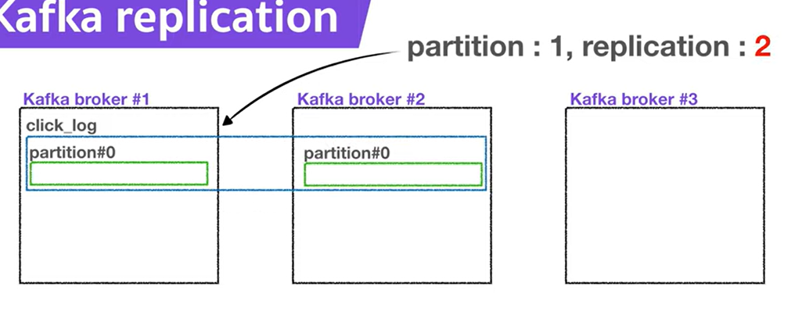

# Kafka Replication과 ISR

## Kafka Broker, Replication, ISR 
`Kafka Broker`는 카프카가 설치되어 잇는 단위. 보통 3개 이상으로 구성하여 사용된다

`replication`은 <b>파티션의 복제</b>를 뜻함. `replication`은 복제본을 포함한 파티션의 수로, 브로커의 총 개수보다 많을 수 없다.

예를 들어, partition이 1, replication이 1, broker가 3인 topic이 있다면 아래와 같은 형태일 것이다.

여기서 `replication`이 2가 된다면, partition은 원본 1개와 복제본 1개로 총 2가 존재하게 된다.

여기서 앞서 언급했던 것처럼, replication은 브로커의 수보다 많을 수 없기 때문에 replication은 4이상이 될 수 없다.

이와 같이 replication을 두었을때 생기는 partition들은 각각 <b>원본 1</b>개에 해당하는 파티션은 `leader partition`, 나머지 파티션은 `follower partition`이라 부른다. 이 leader partition과 follwer partition을 합쳐서 `ISR(In Sync Peplica)`라고 한다.

## Replica를 사용하는 이유
replication은 partition의 고가용성을 위해 사용한다.

갑자기 broker가 어떠한 이유에 의해 장애가 발생했을때 사용이 불가할 경우, 
replication이 1이고 파티션이 1인 topic의 해당 파티션은 복구가 불가능하다. partition이 2일 경우 복제본은 복구가 가능하기 때문에 leader 파티션의 역할을 승계하여 사용할 수 있다.

### partition의 역할
`producer`가 `topic`의 파티션에 데이터를 전달할 때, leader 파티션이 데이터를 전달받고 follower 파티션은 leader 파티션을 복제한다.
프로듀서의 ack 상세옵션을 통해 고가용성을 유지하는데, partition의 replication과도 밀접하게 관련이 있다.

[프로듀서의 ack 상세옵션]
| value | 설명 |
|-------|------|
| 0 | leader partition에 데이터 전송후 응답값 받지 않음(속도는 빠르지만 데이터 유실 가능성이 있음) |
| 1 | leader partition에 데이터 전송후 응답값 받음(partition 복제 여부는 알 수 없음) |
| all | follwer partition에 복제가 되어있는지까지 응답값 받음(데이터 유실이 없지만 속도가 현저히 느림) | 

replication이 고가용성에서 이처럼 중요한 역할을 한다면 무조건 많은게 좋은게 아닌가? 라고 생각할 수 있다. 하지만 replication의 갯수가 늘면 broker의 리소스의 사용량이 늘기 때문에 실제 kafka에 들어오는 데이터의 양과 저장시간을 고려하여 갯수를 산정해서 사용해야 한다.
