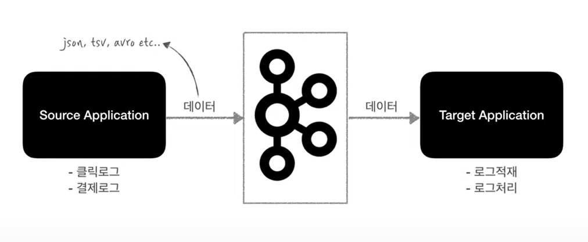
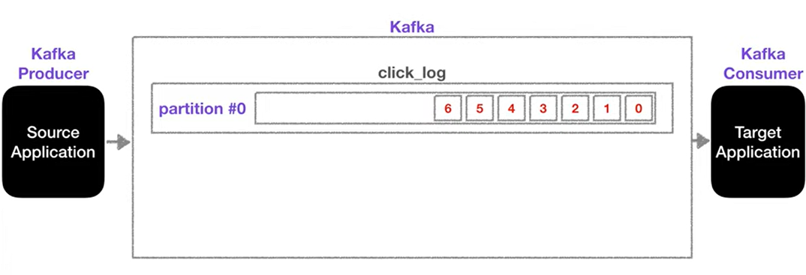
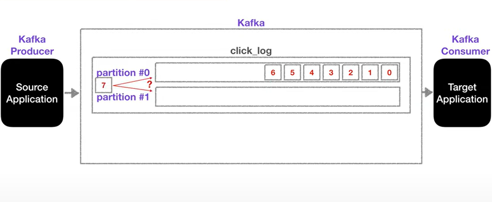
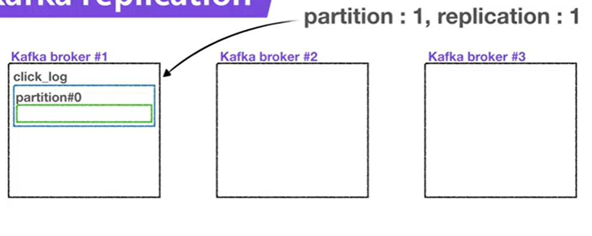
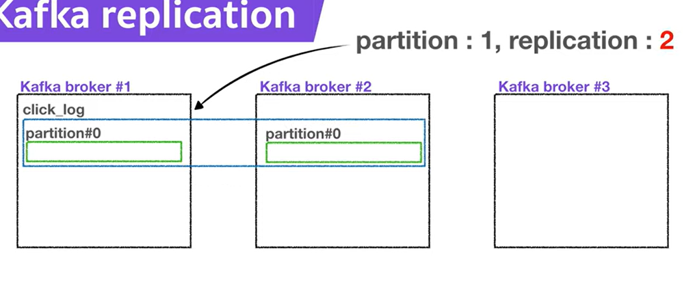

# Apache Kafka

- 개요
소스/타겟 애플리케이션 증가로 데이터 전송라인 복잡 및 파편화 이슈 발생
이에 따른 유지보수 어려움과 복잡함을 해결하기위해 나옴



`kafka`의 queue와 같은 역할을 하는 `topic`에 데이터를 넣는 역할은 `producer`, 가져가는 역할은 `consumer`가 한다. 
`producer`와 `consumer`는 라이브러리 형태로 제공

카프카는 낮은 지연과 높은 처리량을 지원하기때문에 빅(Big) 데이터 처리에는 kafka를 도입하는게 유리
<br/><br/>
## Kafka Topic
카프카에는 다양한 데이터가 들어갈 수 있는데, 그 공간을 `topic`이라고 함
AMQP와는 동작 방식이 상이함

`kafka`에서는 topic을 여러개 생성할 수 있는데, table과 파일시스템의 폴더와 유사한 성질을 가짐
`topic`은 `producer`가 넣고 `consumer`가 가져가는 형태로 이용됨. 
목적에 따라 이름이 부여되는데 클릭로그, send_sms, location_log 등 이용하는 곳을 정확히 명시하는게 좋음



하나의 `topic`은 여러개의 `partition`으로 구성될 수 있으며, 파티션의 번호는 0번부터 시작하여 queue와 같이 데이터가 partition 끝에서부터 저장됨.

`consumer`는 파티션의 데이터가 오래된 순서부터 가져가게 되는데, 이때 `consumer`가 `record`를 가져가도 데이터가 삭제되지 않음.



`partition`이 늘어나면 추가 데이터를 저장하는 방식은 `producer`가 데이터를 보낼때 지정하는 key로 구분된다.

- key가 `null`이고, 기본 파티셔너 사용할 경우 <br/>
-> `라운드로빈(Round robin)`으로 할당
- key가 있고, 기본 파티셔너 사용할 경우 <br/>
-> 키의 `Hash` 값을 구하고 특정 파티션에 할당

<br/>

이때 `partition`은 늘릴 수 있지만 줄일 수 없다. 단 `partition`의 `record`는 옵션에 따라 일정 기간 혹은 용량동안 저장된 뒤 데이터가 삭제될 수 있도록 설정할 수 있다.

<br/><br/>
## Kafka Producer

producer 역할

- topic에 해당하는 메세지를 생성
- 특정 topic으로 데이터를 publish
- kafka로 처리 실패/재시도
* kafka-clients와 kafka broker의 하위호환성이 완벽하지 않으니 호환성 확인 필요

<br/>

카프카 프로듀서로 데이터 전송하기

```
public class Producer {
    public static void main(String[] args) throws IOException {

        //1) Producer 설정 정의
        Properties configs = new Properties();
        configs.put("bootstrap.servers" , "localhost:9092"); //2개 이상의 브로커 ip, host 설정하기를 권장
        configs.put("key.serializer"    , "org.apache.kafka.common.serialization.StringSerializer"); //key, value를 직렬화 하기 위한 설정
        configs.put("value.serializer"  , "org.apache.kafka.common.serialization.StringSerializer");

        //2) Producer Instance 생성(전송할 객체)
        KafkaProducer<String, String> producer = new KafkaProducer<String, String(configs);

        //3) Record 생성
        //topic, key, value  또는 topic, value로 선택 정의할 수 있다.
        ProducerRecord record = new ProducerRecord<String, String>("topic", "key", "value");

        producer.send(record);
        producer.close();
    }
}
```

<br/><br/>
## Kafka Broker, Replication, ISR

Kafka Broker는 카프카가 설치되어 잇는 단위. 보통 3개 이상으로 구성하여 사용된다


Replication은 파티션의 복제를 뜻함. replication은 복제본을 포함한 파티션의 수로, 브로커의 총 개수보다 많을 수 없다.

예를 들어, partition이 1, replication이 1, broker가 3인 topic이 있다면 아래와 같은 형태일 것이다. 


여기서 replication이 2가 된다면, partition은 원본 1개와 복제본 1개로 총 2가 존재한다



